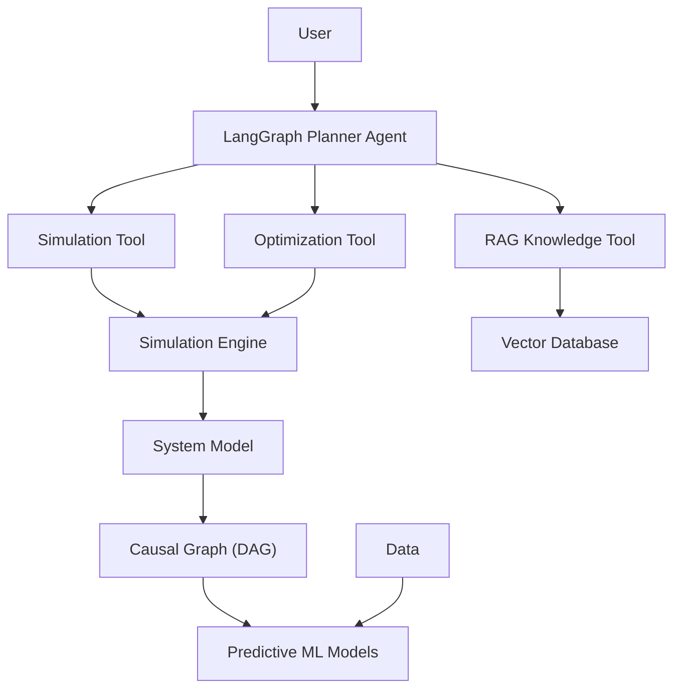
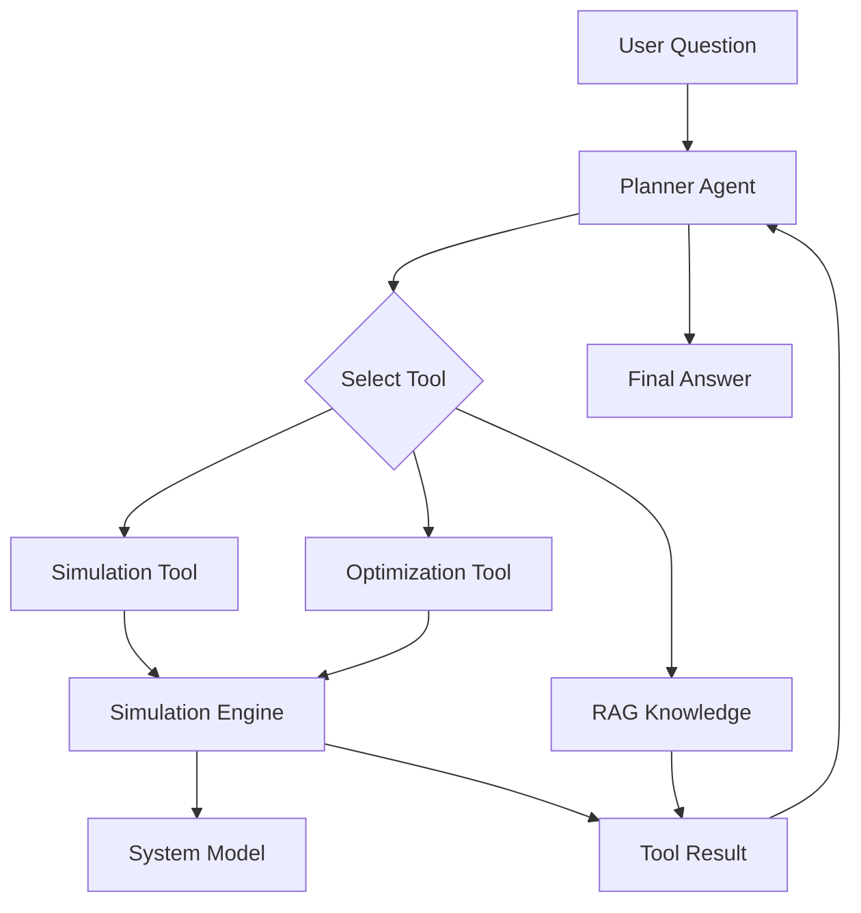

# Decision Intelligence Agent Prototype

This repository implements a **Decision Intelligence prototype**
combining system modelling, predictive machine learning, scenario
simulation, optimization, RAG knowledge retrieval and LLM orchestration
using LangGraph.

The project illustrates how modern AI systems can support **prescriptive
decision making** by combining deterministic analytical components with
LLM‑based orchestration.

---

# Concept

Traditional analytics pipelines typically follow this structure:

```
data → dashboards → human decision
```

Decision Intelligence systems instead attempt to reason about decisions
directly:

```
data → system model → simulation → optimization → recommendation
```

In this prototype:

- the **system model** represents the structure of a business
- **ML models** estimate unknown relationships
- **simulation** explores possible outcomes
- **optimization** searches for the best decision
- an **LLM agent** orchestrates the process

---

# Architecture

The system is organized as a layered architecture.



---

# Agent Execution Flow

The following diagram shows how a user request is processed.



---

# Core Components

## Data Layer

Synthetic business data is generated to simulate historical
observations.

Variables:

- price
- marketing
- demand

Demand follows the relationship:

```
demand = f(price, marketing) + noise
```

---

## Predictive Model

A machine learning model estimates the demand function:

```
price + marketing → demand
```

Implemented using **RandomForest regression**.

---

## System Model

The business is represented as a **causal Directed Acyclic Graph
(DAG)**.

Example relationships:

```
price → demand → revenue → profit

marketing → demand

demand → cost
```

The system model propagates the impact of decisions through this graph.

---

## Simulation Engine

The simulation layer evaluates decisions under uncertainty using **Monte
Carlo simulation**.

Outputs include:

- expected profit
- demand distribution
- risk (variance)

---

## Optimization

The optimization layer explores the decision space and searches for the
decision maximizing expected profit.

Example question:

> "What price should maximize expected profit?"

---

## Knowledge Layer (RAG)

A small knowledge base is indexed in a vector database.

This allows the agent to retrieve explanations about:

- system assumptions
- variable relationships
- simulation methodology

---

## Agent Layer

The agent is implemented using **LangGraph**.

The agent workflow:

1.  receive a user query
2.  decide which tool to use
3.  execute the selected tool
4.  return the result

Key principle:

The LLM **does not compute the decision itself**.

Instead it orchestrates deterministic tools such as:

- simulation
- optimization
- knowledge retrieval

---

# Repository Structure

```
decision-intelligence-agent/
├── data/
│   └── generate_data.py
├── models/
│   └── train_demand_model.py
├── system/
│   ├── system_graph.py
│   └── system_model.py
├── simulation/
│   ├── montecarlo.py
│   └── scenario_runner.py
├── optimization/
│   └── optimizer.py
├── knowledge/
│   ├── build_index.py
│   └── retriever.py
├── agents/
│   ├── state.py
│   ├── tools.py
│   ├── planner.py
│   └── workflow.py
├── config/
│   └── settings.py
├── app.py
├── requirements.txt
└── README.md
```

---

# Setup

Create environment:

```bash
python -m venv venv
```

Activate:

```bash
source venv/bin/activate
```

Install dependencies:

```bash
pip install -r requirements.txt
```

---

# API Key

Create a `.env` file:

```env
OPENAI_API_KEY=your_api_key
```

Get your key from: https://platform.openai.com/api-keys

---

# Generate Dataset

```bash
python data/generate_data.py
```

---

# Train ML Model

```bash
python models/train_demand_model.py
```

---

# Build Knowledge Index

```bash
python knowledge/build_index.py
```

---

# Run the Agent

```bash
python app.py
```

Example:

```
Ask a business question:

What price should maximize profit?
```
