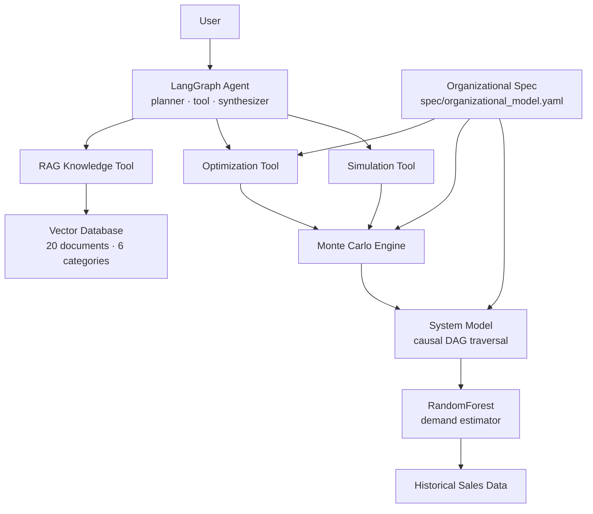
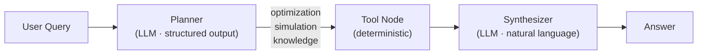

# Decision Intelligence Agent

A **Decision Intelligence prototype** that models how an organization works causally, evaluates decisions under uncertainty, and supports prescriptive reasoning — orchestrated by an LLM agent.

The system combines deterministic analytical components (causal model, ML, Monte Carlo simulation, optimization) with LLM-based orchestration using LangGraph. The LLM **does not compute decisions**: it orchestrates specialized tools that do.

---

## Concept

Traditional analytics pipelines stop at descriptive insight:

```
data → dashboards → human decision
```

Decision Intelligence systems reason about decisions directly:

```
data → causal system model → simulation → optimization → recommendation
```

In this prototype:

- the **organizational spec** declares the domain model as explicit, editable configuration
- the **causal graph (DAG)** represents how business variables relate and propagate
- **ML models** estimate unknown relationships from historical data
- **Monte Carlo simulation** evaluates decisions under uncertainty
- **optimization** searches for the best decision across the decision space
- an **LLM agent** orchestrates the process and synthesizes results in natural language

---

## Design Principles

### 1 — Spec-driven architecture

The entire organizational model is declared in `spec/organizational_model.yaml`. This single file is the **source of truth** for all system components: the causal graph, the simulation engine, the optimizer, and the agent all read from it.

To adapt the system to a new domain or change a business parameter: **edit the spec**. No code changes required.

```yaml
# spec/organizational_model.yaml (excerpt)
variables:
  decisions:
    - name: price
      bounds: { min: 10.0, max: 50.0 }
  targets:
    - name: profit
      optimize: maximize

causal_relationships:
  - from: [price, marketing_spend]
    to: demand
    type: ml_estimated
```

### 2 — LLM orchestrates, tools compute

The LLM never computes a business decision. It selects the appropriate analytical tool (via structured output), passes the query to it, and synthesizes the tool's result into a natural language response.

```
User query → Planner (LLM, tool selection) → Tool (deterministic computation) → Synthesizer (LLM, natural language) → Answer
```

This separation makes the system **auditable, testable, and governable**: every computation is deterministic and inspectable, independent of the LLM.

### 3 — Graph-driven propagation

The causal DAG is not decorative. The `SystemModel.evaluate()` method propagates values through the graph in **topological order**: each node is computed only after all its causal predecessors have been resolved. Adding a new causal variable requires only registering its formula and adding an edge to the graph — no changes to the evaluation logic.

---

## Architecture



---

## Agent Execution Flow



The planner uses **structured output** (Pydantic schema) to guarantee the tool selection is always a valid, typed value — no fragile string parsing.

The synthesizer receives the raw tool result and produces a business-oriented response: it explains what the numbers mean, not just what they are.

---

## Core Components

### Organizational Spec (`spec/`)

`organizational_model.yaml` declares:

- **Decision variables**: controllable inputs (price, marketing spend), with bounds and defaults
- **Intermediate variables**: derived or ML-estimated (demand, revenue, cost)
- **Target variables**: business outcomes to optimize (profit)
- **Causal relationships**: the edges of the DAG, with type (ml_estimated / formula)
- **Business parameters**: unit cost and other domain constants
- **Simulation configuration**: Monte Carlo runs, noise model
- **Optimization configuration**: target, method, fixed variables

`spec_loader.py` parses the YAML into typed Python dataclasses and exposes a singleton `get_spec()` used across all components.

---

### Data Layer (`data/`)

Synthetic sales data is generated to simulate historical observations.

Variables: `price`, `marketing`, `demand`

Demand follows the relationship:

```
demand = 120 − 1.6 × price + 0.9 × marketing + noise(σ=5)
```

The data generation parameters reflect realistic price elasticity (negative) and marketing effect (positive). 2,000 samples are generated with `numpy` random seed 42 for reproducibility.

---

### Predictive Model (`models/`)

A **RandomForest regressor** estimates the demand function from historical data:

```
(price, marketing) → demand
```

Training includes an 80/20 train/test split and reports MAE, RMSE and R² on the held-out set, along with feature importances. The trained model is persisted to `models/demand_model.pkl`.

---

### System Model (`system/`)

The business is represented as a **causal Directed Acyclic Graph (DAG)**:


`SystemModel.evaluate()` performs a **topological traversal** of the DAG:
1. Initialises decision nodes with input values
2. For each node in topological order: computes via ML model (demand) or registered formula (revenue, cost, profit)
3. Returns a complete dict of all variable values

The graph structure is loaded from the spec — adding a new causal variable requires only a new formula entry and a new edge in `system_graph.py`.

---

### Simulation Engine (`simulation/`)

`monte_carlo()` evaluates a `(price, marketing)` decision under uncertainty by running **N independent simulations** (default: 500, configurable in the spec), each with a Gaussian perturbation on the demand estimate.

Output statistics:

| Field | Description |
|---|---|
| `expected_profit` | Mean profit across all runs |
| `profit_std` | Standard deviation — spread of outcomes |
| `profit_p10` | 10th percentile — pessimistic scenario |
| `profit_p90` | 90th percentile — optimistic scenario |
| `expected_demand` | Mean demand across all runs |
| `demand_std` | Demand variability |
| `downside_risk_pct` | % of runs where profit < 0 |
| `n_runs` | Number of simulations executed |

---

### Optimization (`optimization/`)

`optimize_price()` performs a **grid search** over the price range (bounds from spec), evaluating each candidate price via Monte Carlo simulation and selecting the one that maximises `expected_profit`.

Marketing spend is held fixed at the value declared in `spec.optimization.fixed_variables`.

---

### Knowledge Layer (`knowledge/`)

A FAISS vector database indexes **20 domain documents** across 6 categories:

| Category | Content |
|---|---|
| `business_model` | Business overview, decision variables, constraints |
| `causal_model` | Demand function, revenue, cost, profit relationships |
| `ml_model` | RandomForest description, uncertainty interpretation |
| `simulation` | Monte Carlo methodology, output interpretation, risk metrics |
| `optimization` | Grid search approach, optimal price interpretation |
| `interpretation` | Price elasticity, marketing ROI, decision guidance |

The vectorstore is loaded **lazily** (on first query, not at import time). If the index does not exist, an explicit error is raised with instructions.

---

### Agent Layer (`agents/`)

The agent is implemented as a **3-node LangGraph graph**:

**`planner_node`** — Selects the appropriate tool using `gpt-4o-mini` with structured output. The LLM receives a full system prompt describing the domain and each tool's purpose. Output is a typed `ToolSelection(tool, reasoning)` object — no string parsing.

**`tool_node`** — Executes the selected tool. Wrapped in `try/except`: errors are captured and propagated to the state rather than crashing the graph.

**`synthesizer_node`** — Receives the raw tool output and the original query, and produces a business-oriented natural language answer: what do the numbers mean, what should the decision-maker do.

**`AgentState`** TypedDict fields:

| Field | Set by | Description |
|---|---|---|
| `query` | Input | User's original question |
| `action` | Planner | Selected tool name |
| `reasoning` | Planner | LLM's reasoning for tool selection |
| `raw_result` | Tool | Raw output from the analytical tool |
| `answer` | Synthesizer | Final natural language response |

---

## Repository Structure

```
decision-intelligence-agent/
├── spec/
│   ├── organizational_model.yaml   # ← Single source of truth for the domain model
│   ├── spec_loader.py              # Typed YAML parser, singleton get_spec()
│   └── __init__.py
├── data/
│   └── generate_data.py            # Synthetic sales dataset (2,000 samples)
├── models/
│   └── train_demand_model.py       # RF training, evaluation metrics, model export
├── system/
│   ├── system_graph.py             # Causal DAG — edges loaded from spec
│   └── system_model.py             # Graph-traversal evaluation engine
├── simulation/
│   ├── montecarlo.py               # Monte Carlo engine (N runs, noise model)
│   └── scenario_runner.py          # Scenario wrapper
├── optimization/
│   └── optimizer.py                # Grid search over price range
├── knowledge/
│   ├── build_index.py              # FAISS index builder (20 docs, 6 categories)
│   └── retriever.py                # Lazy-loaded similarity search
├── agents/
│   ├── state.py                    # AgentState TypedDict
│   ├── tools.py                    # Tool wrappers (spec-driven defaults)
│   ├── planner.py                  # LLM planner with structured output
│   └── workflow.py                 # LangGraph: planner → tool → synthesizer
├── config/
│   └── settings.py                 # Thin adapter over spec (backward-compatible)
├── app.py                          # REPL entry point with error handling
├── requirements.txt
└── README.md
```

---

## Setup

**1. Create and activate a virtual environment**

```bash
python -m venv venv
source venv/bin/activate        # Linux / macOS
venv\Scripts\activate           # Windows
```

**2. Install dependencies**

```bash
pip install -r requirements.txt
```

**3. Configure API key**

Create a `.env` file in the project root:

```env
OPENAI_API_KEY=your_api_key
```

Get your key from: https://platform.openai.com/api-keys

---

## Build Artefacts

These steps generate the files the agent needs at runtime. Run them once after setup (and again if you modify the spec or data):

**Generate synthetic dataset**

```bash
python data/generate_data.py
```

**Train the demand model**

```bash
python models/train_demand_model.py
```

Output: `models/demand_model.pkl` — also prints MAE, RMSE and R² on the test set.

**Build the knowledge index**

```bash
python knowledge/build_index.py
```

Output: `knowledge_index/` directory — FAISS index of 20 domain documents.

> The organizational spec (`spec/organizational_model.yaml`) is loaded automatically at runtime. No additional build step required.

---

## Run the Agent

```bash
python app.py
```

**Example session:**

```
╔══════════════════════════════════════════════════════════╗
║        Decision Intelligence Agent                      ║
╠══════════════════════════════════════════════════════════╣
║  Ask business questions about pricing and marketing.    ║
║  Examples:                                              ║
║    • What price should maximise profit?                 ║
║    • What happens if I set price to 30?                 ║
║    • How does the demand model work?                    ║
║  Type 'exit' to quit.                                   ║
╚══════════════════════════════════════════════════════════╝

Ask a business question: What price should maximise profit?

Based on the optimization analysis, the price that maximises expected
profit is approximately 23.7 EUR, yielding an expected profit of 412 EUR
per period. At this price, demand is estimated at 43 units with a
downside risk of less than 2% (probability of loss). Setting price
above 30 EUR reduces demand sharply due to price elasticity, lowering
total profit despite the higher margin per unit.

Ask a business question: exit
Goodbye.
```

---

## Adapting to a New Domain

The spec-driven architecture makes domain adaptation straightforward. To model a different business scenario:

1. Edit `spec/organizational_model.yaml` — define your variables, causal relationships, bounds and parameters
2. Register formula functions for new derived nodes in `system/system_model.py` (`_NODE_FORMULAS`)
3. Retrain the ML model if the input/output variables change (`models/train_demand_model.py`)
4. Rebuild the knowledge index with domain-specific documents (`knowledge/build_index.py`)

No changes to the agent, planner, workflow, or simulation engine are required.

---

## Key Design Decisions

| Decision | Rationale |
|---|---|
| Spec-driven YAML over hardcoded parameters | Domain model is explicit, auditable, and changeable without touching code |
| LLM selects tools via structured output (Pydantic) | Eliminates fragile string parsing; tool selection is always a valid typed value |
| LLM orchestrates, does not compute | Computations are deterministic and testable; LLM adds language understanding and synthesis |
| DAG-driven topological evaluation | Adding new causal variables requires only formula registration, not refactoring `evaluate()` |
| Lazy FAISS loading | Import never fails due to missing index; failure is explicit and informative |
| Synthesizer node separate from tool node | Raw analytical output and natural language presentation are decoupled concerns |
| Monte Carlo over point estimates | Decisions are evaluated under uncertainty; risk (downside_risk_pct) is a first-class output |
